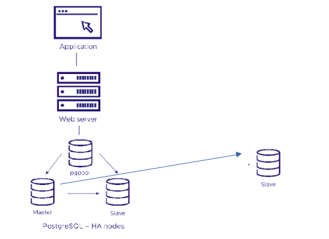

# Postgres High Availability deployment using Helm Charts
This deployment uses the postgresql-ha chart from Bitnami.

This is the architectural diagram of how the solution looks like.


##Instructions

### Prerequisites

- Minikube v1.33.1
- Helm 3.15.4

P.S. The charts used below are included in this repo in the directory `charts`.

### Install postgresql-ha chart
For simplicity, we will add an alias to kubectl as below.
```console
alias kubectl='minikube kubectl --'
```
Add bitnami repository
```console
helm repo add bitnami https://charts.bitnami.com/bitnami
```

Install postgresql-ha chart
```console
helm install hadbcluster oci://registry-1.docker.io/bitnamicharts/postgresql-ha
```

When installation is complete, there will be 3 postgresql nodes, and 1 pgpool node. The address of internal connections will be displayed on the screen. Check the status of the pods using the command below. Also, to connect from outside the cluster, we need to perform port forwarding by running the next command.

```console
kubectl get pod
kubectl port-forward --namespace default svc/hadbcluster-postgresql-ha-pgpool 5432:5432
```

Connect to the database using psql on localhost.
```console
psql -h 127.0.0.1 -p 5432 -U postgres -d postgres
```

The database password can be retrieved using the command below.
```console
kubectl get secret --namespace default hadbcluster-postgresql-ha-postgresql -o jsonpath="{.data.password}" | base64 -d
```
Since this is the pgpool instance, check the status of the other nodes by using this query.
```console
show pool_nodes;
```
The database password can be specified during installation by including it in values.yaml file. 

An employees database will be created by executing the sql files in the repo and other 2 tables. These are related by a foreign key using the staff_no column.

Execute the python script to populate the tables with 100,000 records. Modify the host endpoint details as required.

### Deployment of the standalone replica 
The values.yaml file will be used to make this deployment. It contains options for setting up the server as a replica, as well as the master postgres password.
```console
helm install -f values.yaml dbrepl bitnami/postgresql
```
We can check the status of the instance using the helm status command
```console
helm ls
helm status dbrepl
```
We can check the status and logs of the pods.
```console
kubectl get po
kubectl logs dbrepl-postgresql-0
```
Using pg_basebackup, configure assynchronous replication. Confirm the master host from pgpool and get it's address. Get the repmgr password in a similar way as the main postgres password above.
```console
export PGPASSWORD=sRIMdHWFey
pg_basebackup -h hadbcluster-postgresql-0.my-release-postgresql-ha-postgresql-headless -p 5432 -U repmgr -D /bitnami/postgresql/data -Fp -Xs -R
```
Connect directly to the replica database using instructions from helm and confirm the replication status as below.
```console
helm status dbrepl 							 #get the command needed to connect to the database
postgres=# select state, client_hostname, write_lag, replay_lag, flush_lag  FROM pg_stat_replication;
postgres=# select pg_is_in_recovery();
```

